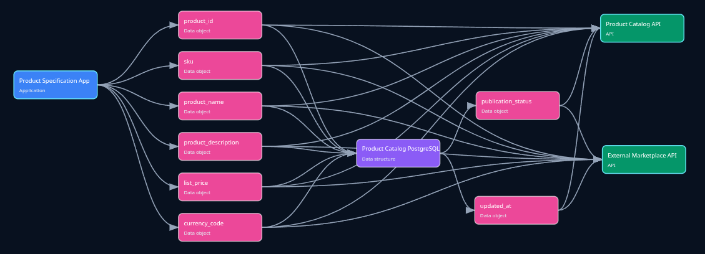

# Source2Lineage

<div align="center">
  
</div>

**Turn an unfamiliar codebase into an evidence-backed data-lineage catalog and a readable
system explanation.**

Source2Lineage is a dependency-free agent system that statically analyzes a codebase and
creates two reviewable artifacts:

- `data-lineage.yaml` — systems, connections, data objects, sources, and targets in the catalog
  schema used by the browser lineage tools.
- `system-analysis.md` — a human explanation with system inventory, flow narratives, source
  evidence, uncertainties, and reproduction notes.

The YAML catalog format is defined by the standalone
[`datainsightat/s2l` specification](https://github.com/datainsightat/s2l).

It follows the same prompt-native structure as FeatherSpec: one tool-neutral constitution,
shared workflow files, thin Claude Code/GitHub Copilot loaders, and a bounded specialist agent.
There is no analysis server, package install, or application instrumentation.

## What it does

- Discovers projects from common manifests and workspace references.
- Maps local cross-project imports and references.
- Detects HTTP, GraphQL, and gRPC servers and clients from explicit source evidence.
- Detects SQL schemas, reads, writes, migrations, and explicit ORM mappings.
- Detects explicit queues, topics, messages, file exchanges, and object-store flows.
- Produces a browser-compatible catalog conforming to the S2L version 6 specification.
- Separates confirmed findings from probable or runtime-only behavior.
- Uses isolated scout agents for large repositories when the host supports delegation.
- Validates schema, references, report completeness, and cross-file consistency before handoff.

## Bundled browser app

<div align="center">
  
</div>

The interactive analyzer and catalog editor now live under [`app/`](app/):

- [`app/source_lineage_analyzer.html`](app/source_lineage_analyzer.html) — browser analyzer,
  YAML editor, system/data-object forms, and interactive visualizations.
- [`app/source_lineage_engine.js`](app/source_lineage_engine.js) — shared static-analysis engine.
- [`app/source_lineage_cli.js`](app/source_lineage_cli.js) — command-line wrapper around the
  same engine.
- [`app/demo_product_catalog.yaml`](app/demo_product_catalog.yaml) — ready-to-open product
  lineage example.

The app is standalone and does not need a web server. After cloning or downloading the
repository, open [`app/source_lineage_analyzer.html`](app/source_lineage_analyzer.html)
directly in a current browser. To explore without scanning a repository, select **Open YAML**
and choose `app/demo_product_catalog.yaml`.

## Quick start

### Claude Code

Open this folder as the workspace:

```bash
cd source2lineage
claude
```

Run the analyzer with an explicit source and output path:

```text
/lineage-analyze /path/to/codebase /path/to/codebase/.lineage
```

`CLAUDE.md` loads `AGENTS.md`, and Claude Code discovers the commands and scout definition
under `.claude/`.

### GitHub Copilot in VS Code

Open `source2lineage` as the workspace, enable Agent mode, and optionally select the
**Source2Lineage** custom agent. Run:

```text
/lineage-analyze /path/to/codebase /path/to/codebase/.lineage
```

The `.vscode/settings.json` file enables the agent, prompt, instruction, and `AGENTS.md`
locations used by the template.

Your coding agent must have read access to the source path and write access to the output path.
When sandboxed to one workspace, copy/install the template into the target repository instead.

## Install into an existing repository

Copy these entries from `source2lineage` into the repository root:

```text
AGENTS.md
CLAUDE.md
.claude/
.github/agents/
.github/prompts/
.github/instructions/
.vscode/settings.json
docs/
app/
assets/
schemas/
scripts/
templates/
package.json
```

If the target already has `AGENTS.md`, `CLAUDE.md`, `.claude/`, `.github/`, or VS Code
settings, merge them rather than overwriting them. The essential requirements are that the
Source2Lineage rules remain reachable from the root instructions and that the thin loader paths
still resolve.

After installation, run from the repository root:

```text
/lineage-analyze . .lineage
```

## Commands

### `/lineage-analyze [source path] [output directory]`

Analyzes the source, optionally delegates coherent modules to read-only lineage scouts,
synthesizes one normalized model, creates the two deliverables, and validates them.

Defaults:

```text
source path:      .
output directory: .lineage
```

The command asks before replacing either existing output file. Successful runs remove their
temporary `.lineage-work/` state; failed runs preserve it for diagnosis or resumption.

### `/lineage-validate <YAML path> <Markdown path>`

Runs the dependency-free validator and then checks counts, directions, evidence references,
and confirmed-versus-uncertain classification manually. It does not edit the files.

## Output

The default output directory contains exactly:

```text
.lineage/
├── data-lineage.yaml
└── system-analysis.md
```

The YAML uses JSON syntax, which is valid YAML 1.2. Open it directly in
[`app/source_lineage_analyzer.html`](app/source_lineage_analyzer.html) to edit systems and data
objects or use the interactive visualizations.

The Markdown report includes:

- an executive summary and analysis scope;
- system responsibilities and explicit web addresses;
- end-to-end data-flow narratives;
- a data-object dictionary;
- a repository-relative evidence index;
- probable findings, blind spots, and static-analysis limitations;
- the validator command and result.

See [Output Contract](docs/output-contract.md) for Source2Lineage's S2L generation rules and a
complete example.

## Agent workflow

```text
inventory → worklist → scout reports → synthesis → two outputs → validation
```

The main agent owns preflight, repository partitioning, synthesis, output collision handling,
and validation. Each `lineage-scout` reads one bounded unit and writes one evidence report. A
scout cannot write final output or follow a dependency deep into a sibling unit. This keeps
parallel analysis reconcilable and prevents multiple agents from racing on the same files.

See [Architecture](docs/architecture.md) for component boundaries and runtime state.

## Evidence and safety

Only direct syntax or configuration evidence enters the YAML catalog. Indirect or unresolved
signals are recorded in the Markdown limitations section. The agent never executes application
code, builds, migrations, package managers, or network requests to discover lineage.

The workflow excludes secrets, environment files, keys, credentials, dependencies, generated
content, VCS metadata, build output, caches, binaries, and oversized files. It never embeds
source evidence inside the YAML because the browser catalog schema does not accept it.

See [Detection Guide](docs/detection-guide.md) for supported signals, flow direction, data
criticality suggestions, exclusions, and confidence rules.

## Validation and tests

Node.js 18 or newer is used only for validation; no package installation is required.

Validate an artifact pair:

```bash
node scripts/validate-output.mjs .lineage/data-lineage.yaml .lineage/system-analysis.md
```

Run the validator tests:

```bash
npm test
```

The validator checks:

- S2L version 6 schema shape;
- system types, criticality values, and URL protocols;
- unique system names and object IDs;
- valid outputs and source/target references;
- layout and viewport values;
- all required Markdown sections;
- system-name consistency across both files;
- evidence references, static-analysis disclosure, and validator reproduction notes.

## Repository structure

```text
source2lineage/
├── AGENTS.md                         # tool-neutral constitution
├── CLAUDE.md                         # Claude loader
├── assets/source2lineage-hero.png    # README hero artwork
├── app/                              # browser app, CLI, engine, and demo YAML
├── .claude/
│   ├── agents/lineage-scout.md
│   ├── commands/lineage-analyze.md
│   ├── commands/lineage-validate.md
│   └── rules/
├── .github/
│   ├── agents/
│   ├── prompts/                      # thin command loaders
│   └── instructions/                 # thin rule loaders
├── docs/
├── schemas/data-lineage.schema.json
├── scripts/validate-output.mjs
├── templates/system-analysis.md
└── test/
```

## Limitations

Static analysis cannot prove runtime-only dependency injection, reflection, dynamically
constructed SQL or URLs, environment-specific routing, generated clients whose contracts are
absent, or data movement outside the inspected source. The generated graph is an evidence-backed
starting point for review, not proof of complete production behavior.
